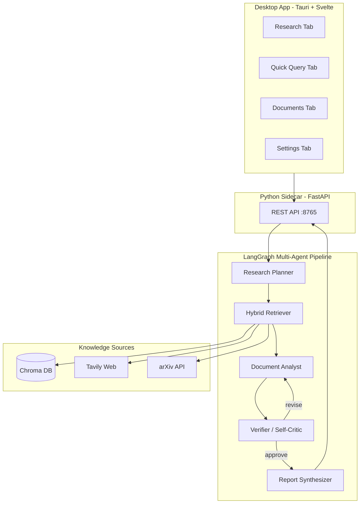

# Second Brain — Project Summary

**Student:** Wong Yan Hao (TP068819)  
**Programme:** B.Sc. (Hons) Computer Science (Artificial Intelligence)  
**Project:** Graph-Based Multi-Agent System for Autonomous Research and Lifelong Personal Knowledge Management  
**Status:** All 5 development phases complete (June 2026)

---

## 1. Project Overview

Second Brain is a **local-first, graph-based multi-agent AI system** that acts as a private research assistant and lifelong knowledge base. Users provide one natural language query; the system autonomously plans research, retrieves from personal documents and external sources, analyses findings with self-critique loops, and produces a structured, cited report.

**Core value:** Private lifelong personal memory + reliable autonomous research workflow.

---

## 2. Technology Stack

| Layer | Technology |
|-------|------------|
| Orchestration | LangGraph |
| Memory / Vector DB | Chroma (persistent, local) |
| Embeddings & LLM | Ollama (`nomic-embed-text`, `llama3.2:3b`) |
| Web search | Tavily API |
| Academic search | arXiv API |
| Backend | Python 3.12 |
| Desktop app | Tauri 2.0 (Rust) + Svelte 5 + TipTap |
| Python sidecar | FastAPI + Uvicorn |
| Document processing | PyPDF, LangChain loaders |

---

## 3. What Was Built — Phase by Phase

### Phase 0: Project Setup & Foundation

**Goal:** Professional project structure and working ingestion pipeline.

**Delivered:**
- Git repository with Python 3.12 virtual environment
- Modular package layout under `src/second_brain/`
- Chroma persistent vector store (`data/chroma/`)
- Document ingestion pipeline for PDF, TXT, and MD files
- Ollama embedding integration (`nomic-embed-text`)
- Minimal LangGraph scaffold (`GraphState` + passthrough node)
- CLI scripts: `ingest.py`, `verify_setup.py`
- Unit tests for ingestion

**Milestone M1 prerequisite:** Working environment with documents loading into Chroma.

---

### Phase 1: Personal Knowledge Base + Simple RAG

**Goal:** Answer questions from personal documents with source citations.

**Delivered:**
- Chroma similarity search retriever
- Ollama LLM wrapper (`llama3.2:3b`)
- RAG chain with citation-aware prompts
- Terminal query interface (`scripts/query.py`)
  - Single-shot and interactive REPL modes
- Source citations with file name and page number

**Milestone M1:** Working personal document RAG in terminal.

---

### Phase 2: Multi-Agent Workflow with LangGraph

**Goal:** Full multi-agent system with self-critique reflection loops.

**Delivered — five agents in order:**

| Agent | Role |
|-------|------|
| Research Planner | Creates research plan + tagged search queries |
| Hybrid Retriever | Multi-query vector search (deduplicated) |
| Document Analyst | Synthesises findings with inline citations |
| Verifier / Self-Critic | Reviews analysis; can send work back for revision |
| Report Synthesizer | Produces structured final report |

**Key features:**
- LangGraph conditional routing (verifier → analyst loop or synthesizer)
- Max 2 revision cycles before forced synthesis
- Terminal research interface (`scripts/research.py`)
- Structured report sections: Executive Summary, Key Findings, Detailed Analysis, Identified Gaps, Sources

**Milestone M2:** Full multi-agent system with self-critique working in terminal.

---

### Phase 3: Hybrid Retrieval + External Tools

**Goal:** Combine personal memory with web and academic sources.

**Delivered:**
- Tavily web search integration (`tools/web_search.py`)
- arXiv academic search (`tools/arxiv_search.py`)
- Planner outputs source-tagged queries: `[personal]`, `[web]`, `[arxiv]`
- Hybrid retriever routes each query to the correct source
- Automatic fallback when personal results are thin
- Retrieval stats and per-query logging in verbose output
- Context formatting labels sources as Personal, Web, or arXiv

**Milestone M3:** Hybrid retrieval (personal + web + arXiv) operational.

---

### Quality Improvements (Pre-Phase 4)

After evaluating a servlet research run, four issues were fixed:

| Issue | Fix |
|-------|-----|
| Web sources mislabeled as academic papers | Rule-based grounding checks in verifier |
| arXiv silently returning zero results | Retry logic + retrieval log + honest gap notes |
| Contradictory "Identified Gaps" section | Tighter synthesizer prompts |
| Bloated Sources section (full slide dumps) | Deterministic bibliography formatter |
| Thin retrieval (6 results) | Defaults increased to 5 per source |

**New files:** `agents/grounding.py`, `agents/retrieval_notes.py`, `rag/citations.py`

---

### Phase 4: Tauri 2.0 Desktop Application

**Goal:** Cross-platform desktop app with Python sidecar.

**Delivered:**

```
Svelte UI  ←→  FastAPI Sidecar (:8765)  ←→  LangGraph System
     ↑
Tauri Rust launcher (auto-spawns Python on app start)
```

**3-pane Second Brain Workspace** (Obsidian/Cursor-style):

| Pane | Role |
|------|------|
| **Left — Vault sidebar** | File tree for `data/documents/`, fuzzy + semantic search, ingest status, recently touched notes |
| **Center — Tabbed workspace** | Research (default), Quick Query, Ingest, Settings, and note tabs |
| **Right — Inspector** | Contextual chat (RAG), agent log, backlinks, sources, “Research this deeply” |

- Resizable/collapsible left and right panes with layout persistence
- Global command bar + `Cmd/Ctrl+K` palette
- **TipTap markdown editor** for `.md` notes: load/save via Tauri FS, YAML frontmatter preserved
- **Wikilinks** `[[Note Name]]` and `[[Target|alias]]` — clickable, resolve by filename
- **Semantic vault search** — toggle calls `POST /api/vault/search` (Chroma embeddings); fuzzy mode uses local Fuse.js
- Vault tree auto-refreshes after “Save as note” and ingest
- Research reports save to `data/documents/research/` with frontmatter

**Sidecar API endpoints:**
- `GET /health`, `GET /api/status`
- `POST /api/query`, `POST /api/research`, `POST /api/ingest`
- `POST /api/vault/search`, `POST /api/vault/related`
- `GET /api/settings`, `PUT /api/settings`

**Milestone M4:** Functional Tauri desktop application with immersive workspace UI.

---

### Phase 5: Evaluation, Optimization & Packaging

**Goal:** Prove the system works and prepare for FYP submission.

**Delivered:**

| Component | Description |
|-----------|-------------|
| 52 benchmark queries | `evaluation/benchmarks.json` (4 categories) |
| Evaluation runner | `scripts/run_evaluation.py` with resume, filters, dry-run |
| Metrics engine | Latency, citations, gaps, per-category breakdown |
| Report generator | `scripts/generate_eval_report.py` → markdown |
| Baseline comparison | CSV template + `scripts/compare_baselines.py` for Claude/Grok |
| UAT questionnaire | `evaluation/uat_questionnaire.md` (12 questions, 5–8 users) |
| Release packaging | `scripts/package_release.sh` (tests + Tauri build) |

**Benchmark breakdown (52 queries):**

| Category | Count | Mode |
|----------|-------|------|
| personal_java | 22 | query |
| hybrid | 15 | research |
| research | 10 | research |
| edge_gaps | 5 | mixed |

**Milestone M5:** Evaluation harness + packaging ready for submission.

---

## 4. System Architecture



---

## 5. Project Structure

```
fyp-second-brain/
├── src/second_brain/          # Core Python package
│   ├── agents/                  # 5 LangGraph agent nodes
│   ├── memory/                  # Chroma, embeddings, LLM, retriever
│   ├── ingestion/               # Document loaders + pipeline
│   ├── rag/                     # RAG chain, prompts, citations
│   ├── tools/                   # Tavily web + arXiv search
│   ├── config.py
│   ├── state.py                 # GraphState definition
│   └── graph.py                 # LangGraph workflow
├── sidecar/                     # FastAPI HTTP server for desktop app
├── desktop/                     # Tauri 2.0 + Svelte frontend
│   ├── src/                     # Svelte UI components
│   └── src-tauri/               # Rust launcher + sidecar spawn
├── evaluation/                  # 52 benchmarks, UAT, results
├── scripts/                     # CLI + evaluation + packaging
├── tests/                       # Unit tests (30+ tests)
├── data/
│   ├── documents/               # User document drop folder
│   └── chroma/                  # Persistent vector DB (gitignored)
├── requirements.txt
├── .env.example
└── README.md
```

---

## 6. How to Run

### Prerequisites

```bash
# Ollama models
ollama pull nomic-embed-text
ollama pull llama3.2:3b

# Python environment
python3.12 -m venv .venv
source .venv/bin/activate
pip install -r requirements.txt
cp .env.example .env
# Add TAVILY_API_KEY to .env for web search
```

### Terminal (CLI)

```bash
# Ingest documents
python scripts/ingest.py --input data/documents

# Quick RAG query
python scripts/query.py "What are servlets in Java?"

# Full multi-agent research
python scripts/research.py "What are servlets in Java?" --verbose
```

### Desktop App

```bash
cd desktop
npm install
npm run tauri dev
```

### Evaluation

```bash
# Preview 52 queries
python scripts/run_evaluation.py --dry-run

# Run full suite
python scripts/run_evaluation.py

# Generate report
python scripts/generate_eval_report.py evaluation/results/run_*.json
```

### Release Build

```bash
./scripts/package_release.sh
```

---

## 7. Test Coverage

| Test file | What it covers |
|-----------|----------------|
| `test_ingestion.py` | Document loading and text splitting |
| `test_retrieval.py` | Chroma retrieval and RAG chain |
| `test_agents.py` | Planner/verifier parsing, graph routing |
| `test_hybrid.py` | Source-tagged queries, web/arXiv retrieval |
| `test_grounding.py` | Rule-based citation validation |
| `test_citations.py` | Bibliography formatting |
| `test_retrieval_notes.py` | Empty arXiv gap notes |
| `test_evaluation.py` | Benchmark suite and metrics |

---

## 8. Key Design Decisions

1. **CLI first, GUI later** — Core logic validated in terminal before Tauri investment.
2. **Local-first** — Ollama + Chroma keep all personal data on-device.
3. **Incremental agents** — Five agents built in dependency order, not all at once.
4. **Rule-based + LLM verification** — Grounding checks catch hallucinations the 3B model misses.
5. **Deterministic bibliography** — Sources section generated from metadata, not LLM prose.
6. **Resume-capable evaluation** — 52-query suite can be interrupted and continued.

---

## 9. Milestones Achieved

| Milestone | Phase | Status |
|-----------|-------|--------|
| M1 — Personal document RAG | Phase 1 | Done |
| M2 — Multi-agent + self-critique | Phase 2 | Done |
| M3 — Hybrid retrieval | Phase 3 | Done |
| M4 — Tauri desktop app | Phase 4 | Done |
| M5 — Evaluation + packaging | Phase 5 | Done |

---

## 10. Remaining Work

### Desktop UI (deferred)

- [ ] Split-view editor + live preview toggle in center pane
- [ ] Full multi-turn contextual AI chat in inspector (currently Quick Query RAG)
- [ ] Interactive knowledge graph / suggested connections beyond “Recently touched”
- [ ] File watcher auto-ingest (`watcher.ts` stub remains)
- [ ] In-app PDF viewing (PDFs appear in tree; only `.md` is editable)

### FYP submission (manual)

- [ ] Run full 52-query evaluation (`python scripts/run_evaluation.py`)
- [ ] Run 10–15 queries through Claude and Grok; score in `evaluation/baseline_template.csv`
- [ ] Conduct UAT with 5–8 participants using `evaluation/uat_questionnaire.md`
- [ ] Build release `.dmg` (`./scripts/package_release.sh`)
- [ ] Push to GitHub and tag `v1.0.0`
- [ ] Write evaluation chapter in FYP report using generated markdown reports

---

*Generated as part of FYP development — TP068819, June 2026.*