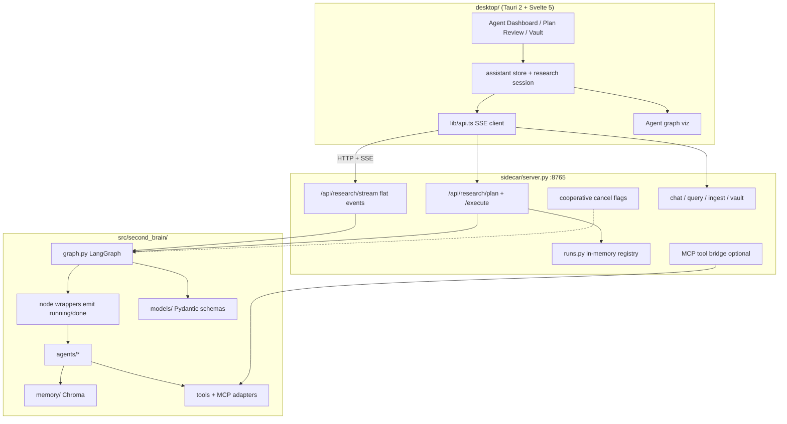
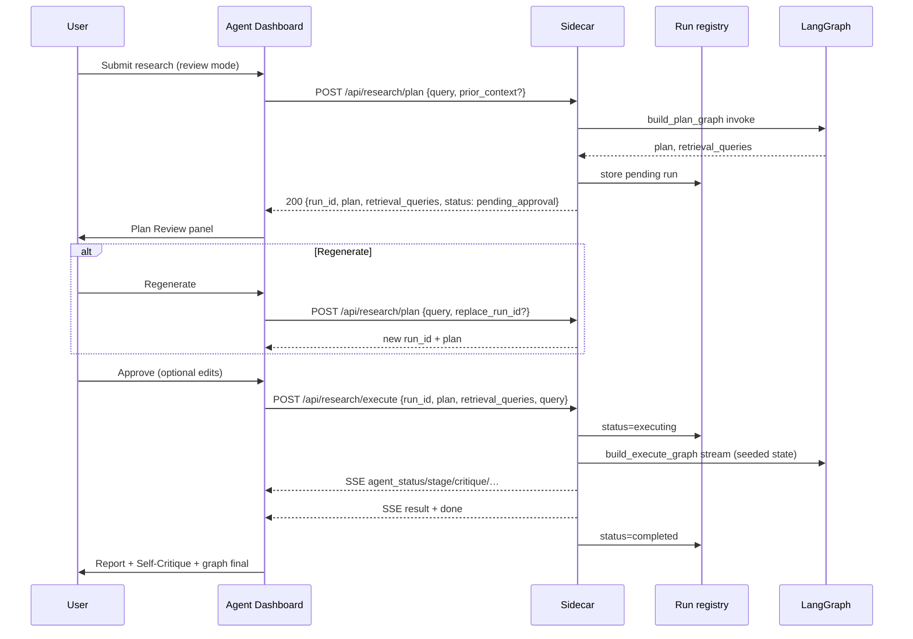
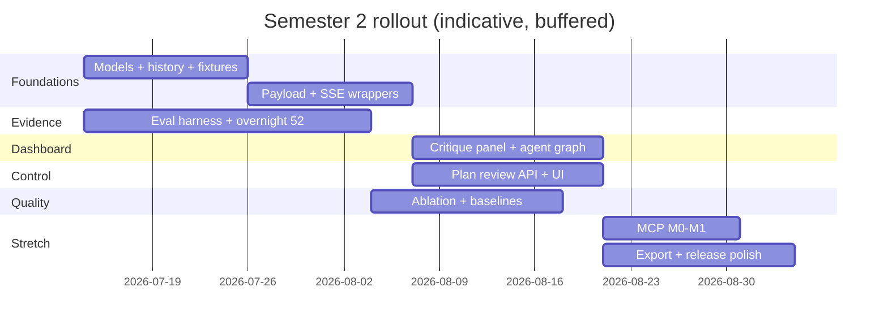
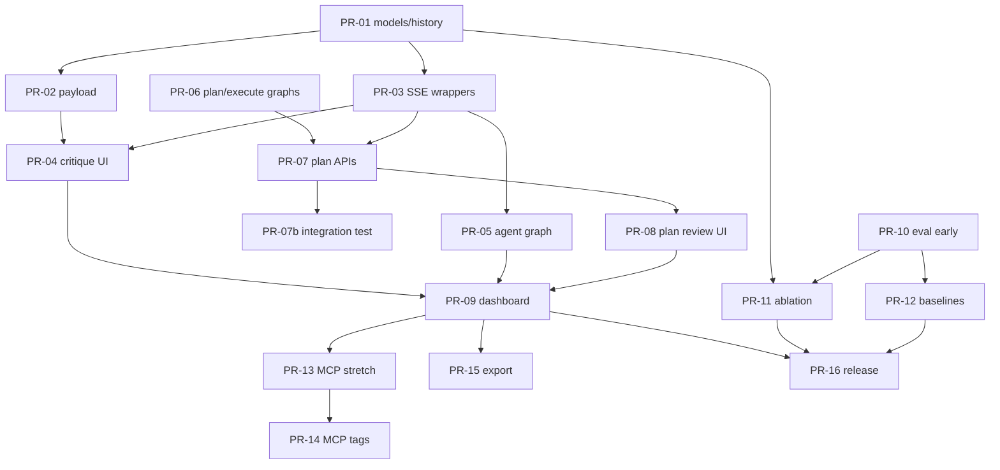

# Semester 2 Architecture & Implementation Plan — Nous (Second Brain FYP)

| Field | Value |
|-------|--------|
| **Document title** | Semester 2 Architecture & Implementation Plan |
| **Product** | Nous — graph-based multi-agent desktop second brain |
| **Author** | Wong Yan Hao (TP068819) / architecture draft |
| **Date** | 2026-07-13 |
| **Status** | Approved for implementation (user decisions incorporated) |
| **Monorepo root** | `/Users/eugene/fyp-second-brain` |
| **Audience** | Senior engineers / FYP supervisors familiar with the Semester 1 codebase |
| **Durable copy** | `docs/SEMESTER2_ARCHITECTURE.md` |

---

## Overview

Nous is already a working **local-first** multi-agent research desktop app: a Tauri 2 + Svelte 5 shell talks to a Python FastAPI sidecar (`sidecar/server.py` on `:8765`), which runs a five-node LangGraph workflow (planner → retriever → analyst ⇄ verifier → synthesizer) over Chroma personal memory plus Tavily/arXiv tools. Semester 1 delivered a usable end-to-end loop, vault UX, SSE stage streaming, and an evaluation harness.

Semester 2 does **not** rebuild the monorepo. It **extends** `src/second_brain/`, `sidecar/`, and `desktop/` to make the product’s differentiators first-class: **visible multi-agent orchestration**, **structured self-critique with revision history**, **plan review before execution**, richer knowledge-base / MCP integrations, stronger evaluation vs baselines, and mission-control polish. The critical path is (1) backend event + critique fidelity, then (2) the Agent Dashboard hero UI, then (3) plan-review UX and MCP/export/eval packaging.

**Rev 2 freezes implementation contracts** an engineer must not invent: flat dual-compat SSE wire format, node-wrapper emission of live `agent_status` (enter/exit), two-phase plan/execute HTTP + run registry, `critique_history` reducer rules, grounding→structured critique mapping, cancel semantics, and ablation flags.

**Rev 3** freezes residual operability contracts: `ACTIVE_RUN` lifecycle (pending plans do **not** hold the lock), event-emission ownership (no dual critique/`agent_status`), `plan_mode=review` sugar vs current `researchStream` client, and required `Annotated[..., operator.add]` keys (no `NotRequired` nesting).

**User-confirmed product decisions (2026-07-13):** plan review **ON by default** (skippable per task / settings); stretch priority **MCP Notion first** (still local-first default off; ahead of Drive and ahead of export if capacity conflicts); evaluation baselines **Claude + Grok**.

**UI product references (authoritative — see `docs/UI_SYSTEM.md`):**
1. **LangGraph Studio** → Agent Dashboard (graph, live status, trace, interrupt)
2. **Elicit** → Report / synthesis (findings, sources table, citations)
3. **Linear** → Overall polish / SpaceX–xAI dark craft
4. **Khoj + Obsidian** → Knowledge base + personal/web hybrid
5. **Cursor** → Transparent agent actions (composer, anti-chatbot)

---

## Background & Motivation

### Why this change is needed

Semester 1 proved the research pipeline works. The remaining gap is **transparency and control**: users see a linear step list and post-hoc plan text, not a live agent graph, structured critique iterations, or a chance to edit the plan before expensive retrieval/analysis. Those are the product differentiators vs “chat with RAG.”

### Current state (verified)

| Layer | What exists |
|-------|-------------|
| Core package | `src/second_brain/` — agents, graph, state, memory, ingestion, tools, RAG |
| Sidecar | FastAPI HTTP + SSE research stream; no WebSocket; no MCP |
| Desktop | Tauri 2 + Svelte 5 + TipTap; vault, graph (force-graph), research thread, command palette |
| Evaluation | 52-query `benchmarks.json`, runner with `resume_from`, metrics, one partial prior run (2/52) |

### Pain points

1. **Streaming fidelity is thin.** `stream_research()` in `graph.py` emits only `("stage", {node, step, detail})` then `("complete", final)`. Detail is truncated plan / stats strings. No per-revision payloads, no critique JSON, no partial analysis, no graph-node status model for the UI. LangGraph `stream_mode="updates"` only fires **after** a node returns—so live `running` is not free.
2. **Critique is a free-text overwrite.** `GraphState.critique: str` is replaced each verifier pass; revision history is not retained (`state.py`, `verifier.py`).
3. **Plan is fire-and-forget.** Planner output goes straight to retriever (`graph.py` edges). UI shows plan only after completion in `ResearchTransparency.svelte`.
4. **Agent “graph” UI is a checklist**, not a graph: `RESEARCH_STEPS` in `assistant.svelte.ts` + progress UI in `AgentView.svelte` (duplicated in `AskPanel.svelte`). Knowledge graph uses `force-graph` for **notes**, not agents.
5. **Research payload omits critique.** `_research_payload()` returns plan/stats/analysis/report but **not** `critique` or `critique_approved`.
6. **Client cancel does not stop the server.** `AbortController` closes the fetch; sidecar `stream_research` continues LLM/tool work (orphan cost / rate limits).
7. **MCP / Notion / Drive** — absent from deps and code.
8. **Export** — Markdown only (`ResearchReport.svelte`); no PDF/DOCX.
9. **Evaluation** — prior run was 2/52 queries; no self-critique ablation or Claude/Grok baseline comparison completed end-to-end.

---

## Phase 0 Status: What Exists vs What Needs to Be Built

This section is the Semester 2 “Phase 0” inventory. Paths are relative to monorepo root unless noted.

### A. Already built (do not redesign from scratch)

#### A.1 Core multi-agent package — `src/second_brain/`

| Component | Path | Notes |
|-----------|------|--------|
| Graph orchestration | `src/second_brain/graph.py` | `build_graph()`, `route_after_verifier`, `run_research`, `stream_research`, `NODE_TO_STEP` |
| Graph state | `src/second_brain/state.py` | `GraphState` TypedDict (all keys required today) |
| Config | `src/second_brain/config.py` | Groq/Ollama, Chroma, `MAX_REVISIONS` (default 2), hybrid flags |
| Planner | `src/second_brain/agents/planner.py` | Plan + tagged search queries |
| Hybrid retriever | `src/second_brain/agents/hybrid_retriever.py`, `retriever_agent.py` | personal / web / arXiv |
| Analyst | `src/second_brain/agents/analyst.py` | Uses free-text `critique` when `revision_count > 0` |
| Verifier | `src/second_brain/agents/verifier.py` | Grounding + LLM verdict; free-text feedback |
| Grounding | `src/second_brain/agents/grounding.py` | Citation bounds + academic-language checks |
| Synthesizer | `src/second_brain/agents/synthesizer.py` | Structured report + bibliography |
| Prompts / utils | `agents/prompts.py`, `utils.py`, `retrieval_notes.py` | Regex parse planner/verifier text |
| Memory | `memory/chroma_store.py`, `embeddings.py`, `llm.py`, `retriever.py` | Local Chroma + Ollama embeddings |
| Ingestion | `ingestion/loaders.py`, `pipeline.py` | PDF/TXT/MD (`SUPPORTED_EXTENSIONS`) |
| Tools | `tools/web_search.py` (Tavily), `tools/arxiv_search.py` | |
| RAG | `rag/chain.py`, `citations.py`, `prompts.py` | Quick query/chat + citations |

**Topology (as implemented):**


#### A.2 Sidecar — `sidecar/server.py`

| Endpoint | Status |
|----------|--------|
| `GET /health` | Exists |
| `GET /api/status` | Exists |
| `POST /api/query` | Exists |
| `POST /api/chat` | Exists |
| `POST /api/research` | Exists (blocking) |
| `POST /api/research/stream` | Exists (SSE, **flat** events, `stream_mode="updates"`) |
| `POST /api/ingest`, `/api/ingest/file` | Exists |
| `POST /api/vault/search`, `/api/vault/related` | Exists |
| `GET/PUT /api/settings` | Exists (`ENV_KEYS` allowlist) |

Transport: **SSE only** for research progress. No WebSocket. No interrupt/approve plan endpoints. No server-side cancel token. CORS is `allow_origins=["*"]` (lax; localhost-only bind mitigates).

#### A.3 Desktop — `desktop/`

| Area | Paths | Status |
|------|-------|--------|
| Shell | `AppShell.svelte`, `TopicRail`, `AppHeader`, Agent/Document views | Mission-control-ish dark UI (`app.css` near-monochrome) |
| Research thread | `AgentView.svelte`, `assistant.svelte.ts` | SSE stages → linear step progress |
| Legacy/alternate research UI | `AskPanel.svelte` | **Duplicates** step-progress research UI vs `AgentView` — DRY opportunity in dashboard polish |
| Transparency | `ResearchTransparency.svelte`, `assistant/transparency.ts` | Post-hoc plan + stats + revision count |
| Report | `ResearchReport.svelte`, `research/render.ts`, `gaps.ts` | MD render, save-as-note, export MD |
| Vault | `VaultSidebar`, TipTap editor, wikilinks, watcher | Solid |
| Note knowledge graph | `KnowledgeGraph.svelte` + `force-graph` | Note-link graph only |
| API client | `lib/api.ts` | HTTP + SSE parser; expects **flat** `ResearchStreamEvent` |
| Sidecar lifecycle | `src-tauri/src/lib.rs` | Auto-spawn Python venv process (restart wipes in-memory state) |

#### A.4 Evaluation — `evaluation/`

| Asset | Path | Status |
|-------|------|--------|
| 52 queries | `evaluation/benchmarks.json` | personal_java, hybrid, research, edge_gaps |
| Runner / metrics | `runner.py`, `metrics.py` | Success, latency, citations, gaps, revisions; **`resume_from` already implemented** in `run_evaluation` |
| Baselines template | `baseline_template.csv` | Present |
| UAT | `uat_questionnaire.md` | Present |
| Prior run | `results/run_20260624_132619.*` | **Only 2/52 queries** |

What is missing for full eval ops (not resume core): CLI flags for resume path / category filter / inter-query sleep; pacing for Groq TPM; grounding-fail metric; critique_history in result JSON; overnight full-suite run artifacts.

#### A.5 Docs & packaging

- `README.md`, `PROJECT_SUMMARY.md` claim Phases 0–5 of original roadmap complete.
- Scripts: `scripts/research.py`, `query.py`, `ingest.py`, `run_evaluation.py`, `package_release.sh`, `start_sidecar.sh`.
- Tests under `tests/` for agents, graph, grounding, hybrid, chat, citations, etc.

### B. Missing or incomplete vs Semester 2 vision

| Capability | Status | Gap detail |
|------------|--------|------------|
| **Live agent graph visualization** | Missing | Only `RESEARCH_STEPS` checklist; no node/edge canvas with status colors for agents |
| **True live `running` node status** | Missing | `stream_mode="updates"` is post-node only; needs wrappers (see §2) |
| **Plan Review screen** | Missing | No plan/execute API; plan is post-hoc in transparency panel |
| **Structured critique + iteration history** | Partial | Free-text `critique`; no `critique_history`; UI has revision **count** only |
| **Rich Self-Critique Panel** | Missing | No structured issues list, severity, iteration timeline |
| **SSE event richness** | Partial | Flat stage strings only; payload omits critique |
| **Server-side research cancel** | Missing | Client abort only |
| **WebSocket** | Missing | Not required (SSE extended) |
| **Pydantic models for reports/critiques** | Partial | Sidecar request models only; graph uses TypedDict + strings |
| **MCP (Notion, Drive, …)** | Missing | No MCP client/server; not in `requirements.txt` |
| **Export PDF/DOCX** | Missing | Markdown export only |
| **Mission-control aesthetic upgrade** | Partial | Dark monochrome exists; needs telemetry-style agent dashboard chrome |
| **Full 52-query eval + baselines + ablation** | Incomplete | One 2-query run; resume exists but ops tooling incomplete |
| **Production packaging polish** | Partial | Scripts exist; needs packaging verification for demo day |
| **AskPanel / AgentView DRY** | Partial | Two research UIs; consolidate in dashboard PR |

### C. Explicit non-rework

Do **not** invent a new `backend/` tree. Prefer:

- Keep `src/second_brain/agents/`, `graph.py`, `state.py`
- Evolve `sidecar/server.py` and `desktop/src/lib/*`
- Optionally **add** `src/second_brain/models/` for Pydantic schemas (new package, not a rename of the monorepo)

---

## Goals & Non-Goals

### Goals

1. **Structured self-critique** end-to-end (schema → state history → stream events → UI panel).
2. **High-fidelity live agent updates** suitable for an Agent Dashboard (true `running` via node wrappers, revision loops, partial artifacts).
3. **Plan → Review → Execute → Report** journey with optional human-in-the-loop plan edit/approve (two-phase HTTP).
4. **Agent Graph Visualization** as the hero surface (live during research).
5. **Phased MCP** for optional external knowledge sources without breaking local-first defaults (**stretch**).
6. **Evaluation completeness**: full 52-query re-run (start early), self-critique ablation, baseline comparison hooks.
7. **Incremental, mergeable PRs** over ~12 weeks with explicit acceptance criteria; MCP/DOCX marked stretch.

### Non-goals

1. Rewriting LangGraph topology into a different framework.
2. Replacing Tauri/Svelte with another desktop stack.
3. Replacing Chroma with a remote vector DB.
4. Building a multi-user / cloud SaaS auth product.
5. Mandatory WebSocket migration (SSE extension preferred).
6. Full Notion/Drive product parity — MCP adapters only as phased integrations.
7. Greenfield “Phase 0–1 setup” (venv, ingestion, basic RAG already done).
8. Durable multi-session plan storage across sidecar restarts (in-memory RUNS only; UI handles 404/410).
9. Pause/resume mid-node graph execution (cancel is cooperative best-effort only).

---

## Proposed Design

### High-level architecture (extend, don’t replace)



### Design principle

**Backend differentiators first, dashboard second, integrations third.** Every UI hero feature must be backed by typed events and state fields that already exist in the stream—never only reconstructed from the final report.

---

### 1. Structured critique schema + revision history

#### Current

```python
# state.py
critique: str
critique_approved: bool
revision_count: int
```

Verifier overwrites `critique` each pass; history is lost. `parse_verifier_output` only extracts `VERDICT` + free-text `FEEDBACK`.

#### GraphState extensions + reducer rules (normative)

```python
# state.py (proposed) — match monorepo style: required keys + Annotated reducers
# (same pattern as messages: Annotated[..., add_messages])
from typing import Annotated
from typing_extensions import TypedDict
import operator

class GraphState(TypedDict):
    query: str
    messages: Annotated[list, add_messages]  # existing
    plan: str
    retrieval_queries: list[str]
    retrieval_stats: dict[str, int]
    retrieval_log: list[str]
    retrieved_docs: list[dict]
    analysis: str
    critique: str                    # LATEST free-text summary — analyst contract (overwrite)
    critique_approved: bool
    revision_count: int
    report: str
    # New required keys — ALWAYS set in _initial_state / seed_execute_state
    critique_structured: dict | None
    critique_history: Annotated[list[dict], operator.add]
    analysis_history: Annotated[list[dict], operator.add]
```

**Typing rule (normative):** Prefer **required** keys with `Annotated[list[dict], operator.add]` — **do not** nest as `NotRequired[Annotated[...]]`. Nesting is easy to break if someone later writes `NotRequired[list[dict]]` and silently drops the reducer. Matches current `state.py` style for `messages`. Every entry point (`_initial_state`, `seed_execute_state`, tests) must initialize history lists to `[]` and `critique_structured` to `None`.

**Reducer rule for `critique_history` (KD with PR-01):**

| Field | Merge behavior | Node return contract |
|-------|----------------|----------------------|
| `critique` | **Replace** (default) | Verifier returns latest free-text summary string only |
| `critique_structured` | **Replace** | Verifier returns latest serialized `StructuredCritique` |
| `critique_history` | **`operator.add` (append)** | Verifier returns **`[new_revision_dict]` only** — never the full list |
| `analysis_history` | **`operator.add`** | Analyst returns `[{"revision_index", "analysis_excerpt", "analysis_char_count", "ts"}]` delta (excerpt ≤ 500 chars) |

**Anti-pattern (forbidden):** `return {"critique_history": state["critique_history"] + [item]}` while also using `operator.add` (double-append). With `operator.add`, return **only the delta list**.

**`_initial_state` must set:**

```python
"critique_structured": None,
"critique_history": [],
"analysis_history": [],
```

**PR-01 hard assert:** two verifier revise passes → `len(state["critique_history"]) == 2` (proves reducer is live, not replace).

Analyst continues to read `critique` + `revision_count > 0` only (`analyst.py` unchanged contract). Free-text `critique` = `StructuredCritique.summary` (or grounding bullet list joined with newlines).

#### Pydantic models — `src/second_brain/models/critique.py`

```python
from datetime import datetime, timezone
from enum import Enum
from pydantic import BaseModel, Field

class CritiqueSeverity(str, Enum):
    info = "info"
    minor = "minor"
    major = "major"
    blocking = "blocking"

# Closed set for S2 UI chips (extend only with a code review)
CRITIQUE_CODES = (
    "invalid_citation",      # citation index out of range
    "academic_mislabel",     # web/personal described as academic / academic language without arXiv
    "hallucination",         # claim not supported by sources (LLM)
    "missing_evidence",      # important source content omitted (LLM)
    "citation_error",        # wrong/misused citation (LLM)
    "logical_gap",           # reasoning hole (LLM)
    "other",
)

class CritiqueIssue(BaseModel):
    code: str  # prefer CRITIQUE_CODES
    severity: CritiqueSeverity
    message: str
    citation_indices: list[int] = Field(default_factory=list)

class CritiqueVerdict(str, Enum):
    approved = "approved"
    revise = "revise"

class StructuredCritique(BaseModel):
    verdict: CritiqueVerdict
    summary: str
    issues: list[CritiqueIssue] = Field(default_factory=list)
    grounding_passed: bool = True
    source: str  # "grounding" | "llm" | "forced_max_revisions"
    raw: str | None = None  # original LLM text or grounding blob for debug/trace

class CritiqueRevision(BaseModel):
    revision_index: int       # 0 = first verifier pass on current analysis generation
    critique: StructuredCritique
    analysis_char_count: int = 0
    analysis_excerpt: str = ""  # first 200 chars of analysis under review
    ts: str  # ISO-8601 UTC
```

#### Grounding → CritiqueIssue mapping (normative)

| Grounding condition (`grounding.py`) | `code` | `severity` | `citation_indices` |
|--------------------------------------|--------|------------|--------------------|
| Invalid citation indices | `invalid_citation` | `blocking` | the invalid indices |
| Academic terms present but no arXiv docs | `academic_mislabel` | `major` | `[]` |
| Citation N is web/personal but nearby text uses academic language | `academic_mislabel` | `major` | `[N]` |

If any grounding issue exists:

```python
StructuredCritique(
    verdict=CritiqueVerdict.revise,
    summary="\n".join(f"- {i.message}" for i in issues),  # also → state["critique"]
    issues=issues,
    grounding_passed=False,
    source="grounding",
    raw="\n".join(grounding_issue_strings),
)
```

LLM is **not** called when grounding fails (same as today).

#### LLM structured output method + fallback (normative)

**Primary method:** prompt for a single JSON object matching `StructuredCritique` fields (`verdict`, `summary`, `issues[]`). Prefer `json.loads` on fenced or raw JSON. **Do not** require tool/function-calling for S2 (Groq path variance); optional enhancement later.

**Fallback algorithm** when JSON parse or Pydantic validation fails:

1. Run existing `parse_verifier_output(raw)` → `(approved: bool, feedback: str)`.
2. Build:

```python
StructuredCritique(
    verdict=CritiqueVerdict.approved if approved else CritiqueVerdict.revise,
    summary=feedback,
    issues=[] if approved else [
        CritiqueIssue(
            code="other",
            severity=CritiqueSeverity.major,
            message=feedback[:500],
            citation_indices=[],
        )
    ],
    grounding_passed=True,  # grounding already passed to reach LLM
    source="llm",
    raw=raw,
)
```

3. Optionally one repair re-prompt if JSON invalid **and** `ENABLE_CRITIQUE_REPAIR=true` (default false for latency).

#### Forced max-revisions path

When `not approved and revision_count >= MAX_REVISIONS` (existing force path):

1. Keep the **underlying** issues from the latest grounding/LLM critique.
2. Set `verdict=approved`, `source="forced_max_revisions"`.
3. Prepend summary: `"Max revisions (N) reached. Proceeding with best available analysis.\n" + prior_summary`.
4. Still append one `CritiqueRevision` so history shows the forced approve.
5. Set `critique_approved=True` and free-text `critique` to the forced summary (synthesizer path unchanged).

#### Golden fixtures (PR-01 tests)

| Fixture | Expected |
|---------|----------|
| `grounding_invalid_cite.json` | `source=grounding`, code `invalid_citation`, blocking, revise |
| `grounding_academic_mislabel.json` | `source=grounding`, `academic_mislabel` |
| `llm_revise_json.json` | parsed issues, source llm |
| `llm_approve_fallback_text.txt` | VERDICT APPROVED regex path → issues=[] |
| `forced_max.json` | source forced_max_revisions, verdict approved, issues preserved |

#### API / eval / desktop payload rules

`_research_payload` **must** include:

| Field | Rule |
|-------|------|
| Existing fields | Keep (`query`, `plan`, `retrieval_*`, `analysis`, `revision_count`, `report`) |
| `analysis` | **Keep full text** in API response (today’s behavior; large but needed for advanced panel) |
| `critique` | Latest free-text |
| `critique_approved` | bool |
| `critique_structured` | latest dict or null |
| `critique_history` | full list (typically ≤ 3 entries, &lt; 5 KB) |

**Desktop `localStorage` (`THREAD_STORAGE_KEY`):** when persisting research turns, store full `critique_history` (small). **Do not** persist `retrieved_docs`. Cap thread at 40 turns (existing). If a turn’s serialized size is extreme, strip `analysis` to 4k chars in storage only (keep full in memory for active session).

**Eval `runner.py` (PR-11):** persist `revision_count`, `critique_history`, `critique_approved`, and `grounding_fail_count` (count of history entries with `source=="grounding"` or `grounding_passed==false`) in each result entry for ablation metrics.

---

### 2. Event protocol for live agent updates

#### Decision: **Extend SSE; do not migrate to WebSocket in Semester 2**

| Criterion | SSE (extend) | WebSocket |
|-----------|--------------|-----------|
| Current investment | Working in `api.researchStream` + sidecar | Zero |
| Research is server-push heavy | Fits | Fits |
| Client → server mid-run (cancel) | AbortController + cooperative server flag (see Cancel) | Needs custom messages |
| Plan approve mid-session | **Two-phase REST** (plan POST + execute SSE) | Natural, but more code |
| Proxy/Tauri/fetch reliability | Proven in this app | Extra Rust/CORS surface |
| Complexity for FYP timeline | Low | Medium–high |

#### Wire format matrix (normative — dual-compat, **all flat**)

**All SSE `data:` JSON objects are flat** (no nested `payload` envelope). This matches today’s sidecar and `desktop/src/lib/api.ts` `ResearchStreamEvent`.

| Class | Rule |
|-------|------|
| **Legacy events** | Shape **unchanged** except optional additive fields `run_id`, `seq`, `ts` |
| **New events** | Also **flat** top-level fields; clients ignore unknown `type` values |
| **Forbidden** | Nesting event body under `payload` (would break existing parsers) |

##### Layering: graph generator vs sidecar

| Layer | Yields / emits |
|-------|----------------|
| `stream_research` (graph.py) | Internal tuples: `("stage"\|"agent_status"\|"artifact"\|"critique"\|"plan"\|"error"\|"complete", dict)` |
| Sidecar `research_stream` | Maps `"complete"` → SSE `{type:"result", result:...}` then `{type:"done"}`; all other kinds → `{type: kind, **dict}` with `run_id`/`seq`/`ts` injected |

##### Exact JSON examples

**Legacy — stage (unchanged keys; optional metadata):**
```json
{"type":"stage","node":"planner","step":"planning","detail":"1. Investigate…","run_id":"r1","seq":2,"ts":"2026-07-13T10:00:01Z"}
```

**Legacy — result / done / error:**
```json
{"type":"result","result":{ /* ResearchResult */ },"run_id":"r1","seq":40,"ts":"…"}
{"type":"done","run_id":"r1","seq":41,"ts":"…"}
{"type":"error","message":"AI rate limit reached…","run_id":"r1","seq":12,"ts":"…"}
```

**New — agent_status:**
```json
{"type":"agent_status","node":"analyst","status":"running","revision":1,"run_id":"r1","seq":10,"ts":"…"}
{"type":"agent_status","node":"analyst","status":"done","revision":1,"run_id":"r1","seq":11,"ts":"…"}
```

**New — artifact:**
```json
{"type":"artifact","kind":"plan","data":{"plan":"…","retrieval_queries":["[personal] …"]},"run_id":"r1","seq":3,"ts":"…"}
{"type":"artifact","kind":"retrieval_stats","data":{"personal":5,"web":3,"arxiv":0},"run_id":"r1","seq":8,"ts":"…"}
{"type":"artifact","kind":"analysis","data":{"excerpt":"…","char_count":1200},"run_id":"r1","seq":12,"ts":"…"}
```

**New — critique:**
```json
{
  "type":"critique",
  "revision_index":0,
  "critique":{"verdict":"revise","summary":"…","issues":[…],"grounding_passed":true,"source":"llm","raw":null},
  "history_len":1,
  "run_id":"r1","seq":15,"ts":"…"
}
```

**New — plan (plan-review path):**
```json
{
  "type":"plan",
  "plan":"1. …",
  "retrieval_queries":["[personal] servlets","[web] jakarta ee"],
  "awaiting_approval":true,
  "run_id":"r1","seq":4,"ts":"…"
}
```

**New — awaiting_plan_approval (terminal for plan-phase sugar only; see §3 client rules):**
```json
{"type":"awaiting_plan_approval","run_id":"r1","seq":5,"ts":"…"}
```
Then **no** `result`/`done` on that response. **Product UI must not consume this via existing `api.researchStream`** (see §3 — sugar is server/tests-only until a dedicated helper lands).

**New — heartbeat:**
```json
{"type":"heartbeat","run_id":"r1","seq":20,"ts":"…"}
```

#### TypeScript union (desktop)

```typescript
export type AgentNodeStatus =
  | "pending" | "running" | "done" | "error" | "skipped" | "waiting_review" | "looping";

export type ResearchStreamEvent =
  | { type: "stage"; node: string; step: string; detail?: string; run_id?: string; seq?: number; ts?: string }
  | { type: "result"; result: ResearchResult; run_id?: string; seq?: number; ts?: string }
  | { type: "done"; run_id?: string; seq?: number; ts?: string }
  | { type: "error"; message: string; run_id?: string; seq?: number; ts?: string }
  | { type: "agent_status"; node: string; status: AgentNodeStatus; revision?: number; run_id?: string; seq?: number; ts?: string }
  | { type: "artifact"; kind: string; data: unknown; run_id?: string; seq?: number; ts?: string }
  | { type: "critique"; revision_index: number; critique: StructuredCritique; history_len: number; run_id?: string; seq?: number; ts?: string }
  | { type: "plan"; plan: string; retrieval_queries: string[]; awaiting_approval: boolean; run_id?: string; seq?: number; ts?: string }
  | { type: "awaiting_plan_approval"; run_id?: string; seq?: number; ts?: string }
  | { type: "heartbeat"; run_id?: string; seq?: number; ts?: string };
```

Parser rule: switch on `type`; ignore unknown types; **never require** `run_id`/`seq` for legacy paths.

#### Live `agent_status: running` mechanism (normative — KD-11)

LangGraph `stream_mode="updates"` only emits **after** a node function returns. Therefore **bare** `graph.stream` cannot signal enter.

**Chosen approach: node wrappers with a side-channel queue** (Approach A).

```python
# graph.py (conceptual)
from queue import Queue, Empty

def wrap_node(name: str, fn, event_q: Queue, cancel_flag: dict):
    """Wrappers emit ONLY agent_status enter/exit — never critique/artifact/plan/stage."""
    def wrapped(state):
        if cancel_flag.get("cancelled"):
            raise ResearchCancelled(run_id=cancel_flag.get("run_id"))
        rev = state.get("revision_count", 0)
        event_q.put(("agent_status", {"node": name, "status": "running", "revision": rev}))
        try:
            out = fn(state)
            event_q.put(("agent_status", {"node": name, "status": "done", "revision": rev}))
            return out  # do NOT queue critique/artifact here
        except Exception:
            event_q.put(("agent_status", {"node": name, "status": "error", "revision": rev}))
            raise
    return wrapped

def stream_research(...):
    event_q: Queue = Queue()
    cancel_flag = {"cancelled": False, "run_id": run_id}
    graph = build_graph_with_wrappers(event_q, cancel_flag)  # or plan/execute variants
    # Run graph.stream in a worker thread; main generator merges event_q + updates
    ...
```

#### Event emission ownership matrix (normative — no dual emit)

| Event kind | Owner | When |
|------------|-------|------|
| `agent_status` (`running` / `done` / `error`) | **Wrappers → `event_q` only** | Enter/exit of node function |
| `stage` | **Post-update merge only** | After LangGraph `updates` item for that node |
| `artifact` | **Post-update merge only** | Derived from `node_output` (plan excerpt, retrieval_stats, analysis excerpt) |
| `critique` | **Post-update merge only** | After `verifier` update; compute `history_len` from **merged** state (`len(final["critique_history"])`), not from raw delta alone |
| `plan` | **Post-update merge only** (or plan endpoint JSON body — not both on same call) | After `planner` update |
| `heartbeat` | **Merge loop only** | Idle ≥15s |
| `complete` → SSE `result`/`done` | **Sidecar after generator ends** | Once |

**Forbidden:** wrappers emitting `critique`, `artifact`, `stage`, or `plan`. **Forbidden:** post-update merge emitting `agent_status` (would duplicate done/running). One exception: if queue is empty and only legacy stage path exists (old code path), UI infers running — server still should not double-emit statuses.

**Merge algorithm:**

1. Start `graph.stream(..., stream_mode="updates")` on a **worker thread**.
2. Generator loop: non-blocking drain `event_q` (**only** `agent_status`) then block briefly on next update / queue item with timeout (e.g. 0.25s) so heartbeats can fire.
3. After each LangGraph update: merge `node_output` into `final` state; emit **only** `stage` + optional `artifact`/`critique`/`plan` from ownership matrix (never re-emit `agent_status` here).
4. On completion, drain queue, yield `("complete", final_state)` once.

**Rejected alternatives for S2:**

| Alt | Why not primary |
|-----|-----------------|
| (B) Richer LangGraph stream modes only | Version-sensitive (`langgraph>=0.2` unpinned); does not replace need for enter hooks on all providers |
| (C) Post-hoc-only status (“last done + 1 = running”) | Acceptable **UI fallback** if queue fails, but not the product claim for “live mission control” |

**UI fallback (defensive):** if only `stage` events arrive (old sidecar), map current step → `running` and prior steps → `done` (today’s behavior).

**Pin:** after wrappers land, document tested `langgraph` version in `requirements.txt` (e.g. `langgraph>=0.2,<0.4` or exact pin from lock).

#### Cancel semantics (normative — Issue 7)

| Layer | Behavior |
|-------|----------|
| Desktop | `AbortController.abort()` closes fetch (existing) |
| Sidecar | On client disconnect / generator `GeneratorExit`, set `cancel_flag["cancelled"]=True` for that `run_id` |
| Node wrapper | Checks flag **before** each node; raises `ResearchCancelled` |
| Mid-node | **Best-effort only** — in-flight `invoke_llm` / Tavily / arXiv **not** hard-killed in S2 (no shared cancel on HTTP clients) |
| Product copy | UI: “Cancelling…” then “Cancelled — in-flight model call may still finish on the server” if stream already closed |
| Eval | N/A (no cancel) |

**Do not claim** cancel fully stops all token spend. Claim: **cooperative cancel between nodes** + client abort; residual mid-node cost accepted (rate-limit risk noted in Risks).

Optional S2 stretch: pass timeout to Groq client; out of critical path.

#### Single-flight research (server) — `ACTIVE_RUN` lifecycle (normative)

Sidecar keeps `ACTIVE_RUN: str | None` protecting **CPU/LLM graph work only**, not idle plan review.

| Phase | `ACTIVE_RUN` behavior |
|-------|------------------------|
| `POST /api/research/plan` (planner graph invoke) | **Set** `ACTIVE_RUN = run_id` for the duration of the plan graph only; **clear in `finally`** when plan JSON returns (success or error). Concurrent second `/plan` while planner is running → **409**. |
| `pending_approval` idle (user editing plan, minutes) | **`ACTIVE_RUN` is None** — pending does **not** hold the lock. Multiple `RunRecord`s with `status=pending_approval` are OK (subject to TTL/GC). Regenerate (`POST /plan` again) is allowed while other plans sit pending. |
| `POST /api/research/execute` (execute SSE) | **Set** at stream start (`ACTIVE_RUN = run_id`); **clear in `finally`** after `result`/`done`, `error`, client cancel/`GeneratorExit`, or `ResearchCancelled`. |
| `POST /api/research/stream` with `plan_mode=auto` (full graph) | Same as execute: set at start, clear in `finally`. |
| `POST /api/research/stream` with `plan_mode=review` sugar (if enabled) | Set only while plan subgraph runs; clear when stream ends with `awaiting_plan_approval` (idle pending does not hold lock). |
| Double `POST /execute` same `run_id` | **409** via `RunRecord.status != pending_approval` (e.g. already `executing`/`completed`) — **independent of** `ACTIVE_RUN`. |
| Failed / cancelled execute | `finally` **must** clear `ACTIVE_RUN`; next `/plan` or `/stream` succeeds **without sidecar restart**. |
| Sidecar process restart | `ACTIVE_RUN` is memory-only → always starts `None` (same as empty RUNS). |

**409 response body (when graph work busy):**
```json
{"detail": "Research already in progress", "active_run_id": "<uuid>"}
```

**Dev-only:** `force: true` may clear/steal `ACTIVE_RUN` (not for production UI).

**Product implication:** default Plan → Review → Execute never deadlocks the desktop for 30 minutes of plan editing. Only one **in-flight LLM graph** at a time.

**PR-07 acceptance (mandatory):** after failed or cancelled execute, a new `POST /plan` or auto `POST /stream` succeeds without process restart; after plan returns, a second `POST /plan` (regenerate) succeeds while first run remains `pending_approval`.

#### Latency / load targets

| Metric | Target |
|--------|--------|
| `agent_status` running→client | &lt; 100 ms after node entry |
| Stage event after node completion | &lt; 100 ms |
| Full research (typical hybrid) | 30–180 s |
| Concurrent **in-flight graphs** | **1** (HTTP 409 if `ACTIVE_RUN` set); pending plans unlimited (TTL) |
| Heartbeat | every 15s while run active and no event for ≥15s |
| UI event buffer | keep last **200** events per active turn; drop older heartbeats first |

---

### 3. Plan → Review → Execute → Report journey

#### Canonical product path (KD-12) — two-phase HTTP

**Primary (implement this):**

1. `POST /api/research/plan` → JSON plan + `run_id` (planner graph only).
2. User edits in UI.
3. `POST /api/research/execute` → **SSE** stream of retriever→…→synthesizer with flat events + final `result`/`done`.

**Sugar (optional / deferred client):** `POST /api/research/stream` with `plan_mode: "auto"|"review"`:

| `plan_mode` | Server behavior | Desktop client |
|-------------|-----------------|----------------|
| `auto` (default) | Full graph SSE ending in `result` + `done` | Existing `api.researchStream` — **unchanged contract** |
| `review` | Plan subgraph only; emit `plan` + `awaiting_plan_approval`; **no** `result`/`done` | **Do not call via `api.researchStream`** |

**Client contract for `plan_mode=review` (normative):**

Today’s `desktop/src/lib/api.ts` `researchStream` does:

```ts
if (!finalResult) throw new Error("Research stream ended without a result");
```

So ending without `result` is a **hard failure** for that helper. Therefore:

1. **Product UI (PR-08) uses only** `POST /api/research/plan` (JSON) + `POST /api/research/execute` (SSE via a helper that still requires `result`). Primary path never hits the sugar.
2. **`plan_mode=review` sugar is server-side / tests-only** until an explicit helper lands, e.g. `researchStreamUntilPlanApproval(): Promise<PlanApproval>` that treats `awaiting_plan_approval` as success and **does not** require `result`. That helper is **not** required for S2 must-ship.
3. Server may still implement sugar for curl/integration tests; document that callers must not use legacy `researchStream`.
4. PR-03 must not change `researchStream` to break auto mode; PR-07/08 must not route the composer through `plan_mode=review` on the old helper.

**Not used as primary:** single long-lived stream with mid-stream POST body; LangGraph `interrupt_before` + durable checkpointer (see Alternatives).



#### Request / response models (OpenAPI-style)

```python
class ResearchPlanRequest(BaseModel):
    query: str
    prior_context: str | None = None
    replace_run_id: str | None = None  # optional: GC old pending run on regenerate

class ResearchPlanResponse(BaseModel):
    run_id: str
    query: str                      # original user query (not composed)
    composed_query: str             # after _compose_query if prior_context
    plan: str
    retrieval_queries: list[str]
    status: Literal["pending_approval"]
    expires_at: str                 # ISO UTC

class ResearchExecuteRequest(BaseModel):
    run_id: str
    query: str                      # must match stored or be explicit
    plan: str                       # user-edited allowed
    retrieval_queries: list[str]    # user-edited allowed; min 1 after strip
    prior_context: str | None = None  # ignored if run already has composed_query; do not double-compose

class ResearchStreamRequest(BaseModel):  # extends existing
    query: str
    prior_context: str | None = None
    plan_mode: Literal["auto", "review"] = "auto"
```

#### Execute seed state (full `GraphState`)

```python
def seed_execute_state(run: RunRecord, req: ResearchExecuteRequest) -> GraphState:
    return {
        "query": run.composed_query,  # research agents see composed query
        "messages": [],
        "plan": req.plan.strip(),
        "retrieval_queries": [q.strip() for q in req.retrieval_queries if q.strip()],
        "retrieval_stats": {},
        "retrieval_log": [],
        "retrieved_docs": [],
        "analysis": "",
        "critique": "",
        "critique_approved": False,
        "revision_count": 0,
        "report": "",
        "critique_structured": None,
        "critique_history": [],
        "analysis_history": [],
    }
```

**Validation on execute:**

- `run_id` exists → else **404**
- `run.status == pending_approval` → else **409** (already executing/completed/cancelled) or **410** if expired
- `retrieval_queries` non-empty after strip → else **400**
- `plan` non-empty → else **400**
- No LLM re-validation of plan quality in S2 (user owns edits)
- `prior_context`: applied **only at plan time** via existing `_compose_query`; execute uses stored `composed_query`

#### Run registry (`sidecar/runs.py`)

```python
@dataclass
class RunRecord:
    run_id: str
    query: str                 # original
    composed_query: str
    plan: str
    retrieval_queries: list[str]
    status: Literal["pending_approval", "executing", "completed", "cancelled", "expired"]
    created_at: float          # time.time()
    expires_at: float          # created_at + 1800
    thread_id: str | None      # optional client-supplied for log correlation
```

| Policy | Rule |
|--------|------|
| TTL | 30 minutes from create; lazy GC on access + periodic sweep |
| Sidecar restart | Registry empty → execute returns **404**; UI: “Plan expired — regenerate” |
| Double execute | First sets `executing`; second **409** |
| Regenerate | `POST /plan` with same query; optional `replace_run_id` marks old `expired`; new `run_id` always |
| Cancel pending | `DELETE /api/research/runs/{run_id}` → `cancelled` (optional thin endpoint) |
| Completed | Keep record until TTL for debug GET; not re-executable |

```python
# GET /api/research/runs/{run_id}
# 200 → RunRecord public fields
# 404 → unknown
# 410 → known but expired (optional if we tombstone)
```

#### Graph split (Approach C — confirmed)

- `build_plan_graph()`: START → planner → END  
- `build_execute_graph()`: START → retriever → analyst ⇄ verifier → synthesizer → END  
- `build_graph()`: full auto for CLI/eval (`run_research`)

#### UI journey

| Screen | Component | Behavior |
|--------|-----------|----------|
| Composer | `ComposerDock` | Toggle “Review plan before run” — **ON by default** (user-confirmed). User may skip per research run or turn off in Settings (`PLAN_REVIEW_DEFAULT`); not always-required. |
| Plan Review | `PlanReviewPanel.svelte` | Edit plan + query chips; **Approve** → execute SSE; **Cancel** → delete/ignore run; **Regenerate** → `POST /plan` again; **Skip review / run auto** path when toggle off |
| Live run | Agent Dashboard | Graph + status + critique; planner node → `done` after plan phase (not stuck in `waiting_review` after approve) |
| Report | `ResearchReport` + Self-Critique | Final artifacts |

#### Desktop ↔ run_id correlation

- Assistant research turn stores `runId` alongside turn id.
- Logs: `run_id=… turn_id=…` when `NOUS_TRACE=1`.
- Optional request header `X-Nous-Thread-Id` for sidecar logs.

---

### 4. Agent graph visualization

#### Approach: **Custom SVG/Svelte fixed topology** (not force-graph, not Svelte Flow)

force-graph remains for **note** graph only (`KnowledgeGraph.svelte`).

#### Unified status enum (events ≡ UI)

```typescript
export type AgentNodeId = "planner" | "retriever" | "analyst" | "verifier" | "synthesizer";
export type NodeStatus =
  | "pending"
  | "running"
  | "done"
  | "error"
  | "skipped"          // e.g. planner during execute-only stream
  | "waiting_review"   // planner done, user has not approved
  | "looping";         // verifier requested revise; back-edge active until analyst running
```

#### State machine

**Auto mode (`build_graph`):**

1. All nodes `pending`.
2. On `agent_status running` → that node `running`.
3. On `done` → node `done`; next pending.
4. On critique revise → verifier `done`, set edge verifier→analyst `looping`, badge `rev N` from `revision`; analyst goes `running` next.
5. On forced or normal approve → verifier `done` (not looping), synthesizer `running`→`done`.
6. On error → that node `error`; others stay.

**Review mode:**

1. Plan phase: planner `running`→`done`, then planner `waiting_review` until approve (UI local state also OK if only JSON plan response without SSE).
2. After approve / execute stream starts: planner → **`done`** (not waiting); retriever…synthesizer animate; planner never `skipped` if it already ran—use `done`. On **execute-only** stream without re-running planner, mark planner `done` if plan was approved, else `skipped` only if auto-execute without planner (N/A in review path).

**Forced max-revisions:** verifier emits approve with `source=forced_max_revisions` → treat as approve path to synthesizer; **clear looping** edge.

#### Topology edges

```typescript
export const AGENT_EDGES = [
  ["planner", "retriever"],
  ["retriever", "analyst"],
  ["analyst", "verifier"],
  ["verifier", "synthesizer"], // solid
  ["verifier", "analyst"],     // dashed back-edge
] as const;
```

#### Integration

- `AgentGraph.svelte` + `lib/research/agent-graph.ts`
- Driven by `agent_status` + `critique` events; fallback to stage list
- Linear `RESEARCH_STEPS` kept for a11y
- PR-09: DRY shared progress primitives between `AgentView` and `AskPanel` (or deprecate AskPanel path if unused in shell)

---

### 5. Self-Critique Panel (UI)

New: `SelfCritiquePanel.svelte`

- Timeline of `critique_history` (revision 0..N) with `ts`
- Verdict badge, severity chips, issue list (`code` → label)
- Link issue → citation when `citation_indices` set
- Final: Approved / Forced max revisions
- Live updates from `critique` SSE events; hydrate from `result.critique_history`

---

### 6. MCP integration strategy (phased) — **stretch after dashboard**

MCP is **not** present today. Optional tool adapters behind hybrid retriever.

**User-confirmed stretch priority:** when capacity is limited after must-ship work, implement **MCP with Notion first** (read-only M0–M1). Notion ranks **above Google Drive** and **above export stretch** (PDF/DOCX). Local-first default remains **MCP off**.

| Phase | Scope | Deliverable |
|-------|--------|-------------|
| **M0** | Abstraction | `tools/mcp_client.py` + settings; health check |
| **M1** | Read-only **Notion** MCP server (first target) | Map results to `Document` with `source_type="mcp"` / origin Notion |
| **M2** | Planner tags | `[mcp:notion]` (Drive only if time remains after Notion) |
| **M3** | UI | Settings status + transparency chips |

- **Off by default**; eval with MCP disabled  
- Secrets via extended `ENV_KEYS` allowlist (same pattern as settings)  
- Do not block Agent Dashboard  
- **Capacity rule:** PR-13 Notion before PR-14 Drive variants and before PR-15 DOCX; print-PDF may still ship if cheap after dashboard

---

### 7. Export PDF/DOCX

| Format | Approach | Priority |
|--------|----------|----------|
| Markdown | Exists | Keep |
| **PDF** | Print CSS / `window.print` on report view | After dashboard; **below MCP Notion** if schedule slips |
| **DOCX** | Optional `POST /api/export/docx` with **body markdown string only** (no filesystem path input) | Lowest stretch; **defer if MCP Notion needs the slot** |

Export request body:

```json
{"markdown": "...", "title": "optional"}
```

Reject path-like inputs; max body size e.g. 2 MB.

---

### 8. Evaluation re-run plan (52 queries + ablation)

#### Full run (start early — PR-10)

```bash
python scripts/run_evaluation.py --resume evaluation/results/run_partial.json
python scripts/run_evaluation.py --category hybrid --sleep 15
```

**Missing ops to add (resume core already exists):**

| Gap | Work |
|-----|------|
| CLI `--resume PATH` | Wire `resume_from` JSON load in `scripts/run_evaluation.py` |
| `--sleep N` | Inter-query delay for Groq TPM |
| `--category` / `--ids` | Filter subset for smoke |
| Overnight full 52 | Document wall-clock (~hours if hybrid ~2 min avg) |

#### Ablation — single primary switch (normative)

**`ENABLE_SELF_CRITIQUE`** (env/config, default `true`):

| Value | Graph behavior |
|-------|----------------|
| `true` | Current: verifier may REVISE; `route_after_verifier` uses `critique_approved` and `MAX_REVISIONS` (default 2) |
| `false` | **Verifier still runs once** (grounding + LLM) for metrics, but **always** sets `critique_approved=True` after that single pass **without** incrementing a revise loop toward analyst. Implementation: at end of `verifier_node`, if not `ENABLE_SELF_CRITIQUE`: force `critique_approved=True`, do **not** increment `revision_count`, append history with note `ablation_auto_approve=true` in raw/summary prefix. Router always goes to synthesizer. |

**Do not use `MAX_REVISIONS=0` as the ablation definition** — it interacts poorly with “increment then force” and confuses thesis writeup. Keep `MAX_REVISIONS` only for the ON path.

**Optional third arm (out of primary ablation, stretch):** compile graph with analyst→synthesizer edge (no verifier) for cost comparison only—not required for thesis if time-constrained.

#### Metrics extensions (`metrics.py`)

| Metric | Source |
|--------|--------|
| Existing | success, latency, citations, gaps, revision_count |
| `grounding_fail_count` | history entries with `source=="grounding"` or `grounding_passed==false` |
| `critique_issue_count` | sum of issues lengths |
| `forced_approve` | bool if any history `source==forced_max_revisions` |

#### Baselines (user-confirmed: **Claude + Grok**)

Compare Nous multi-agent against **both Claude and Grok** single-shot answers for the evaluation chapter:

1. Select a **sample** of benchmark queries (not necessarily all 52) covering hybrid / research / edge_gaps (and a few personal_java if useful).
2. Fill `evaluation/baseline_template.csv` with Claude and Grok answers (manual API or external scripts — outside core product path).
3. Run `scripts/compare_baselines.py` to produce tables: latency/length/citations (where applicable) and qualitative notes for the thesis.

Both models are in scope; do not drop one without an explicit later decision.

#### Targets (aspirational)

| Metric | Target |
|--------|--------|
| Full 52-query completion | 100% runnable (errors counted) |
| Citation rate (research modes) | ≥ 90% |
| edge_gaps honest gap mention | ≥ 80% |
| Ablation directional signal | Critique ON vs OFF compared on citation/gap/latency |

---

### 9. Mission-control aesthetic (polish lane)

- Telemetry colors **only** on Agent Dashboard (cyan/amber/red status) — **working default** until user revisits global brand accents (still open)
- Vault/editor stay monochrome
- PR-09 consolidates `AgentView` / `AskPanel` progress UI

---

## API / Interface Changes

### Sidecar — additive endpoints

| Method | Path | Purpose |
|--------|------|---------|
| POST | `/api/research/stream` | Flat events + optional `plan_mode`; inject `run_id`/`seq`/`ts` |
| POST | `/api/research/plan` | Planner-only JSON |
| POST | `/api/research/execute` | SSE execute from approved plan |
| GET | `/api/research/runs/{run_id}` | Inspect pending/terminal run |
| DELETE | `/api/research/runs/{run_id}` | Cancel pending plan (optional) |
| POST | `/api/export/docx` | Stretch; body markdown only |
| GET | `/api/mcp/status` | Stretch |

### Backward compatibility

- Flat `stage` / `result` / `done` / `error` **must** keep working with current desktop parsers.
- New types are additive; unknown types ignored.
- CLI `run_research` / eval use full auto graph.
- Non-stream `POST /api/research` remains.

### Critical Python interfaces

```python
def build_plan_graph(): ...
def build_execute_graph(): ...
def build_graph(): ...  # full auto

def stream_research(
    query: str,
    *,
    run_id: str | None = None,
    cancel_flag: dict | None = None,
    event_queue: Queue | None = None,
) -> Iterator[tuple[str, dict]]:
    """Yields (kind, flat_payload_dict) including agent_status via wrappers."""

def stream_execute(
    state: GraphState,
    *,
    run_id: str,
    cancel_flag: dict | None = None,
) -> Iterator[tuple[str, dict]]: ...
```

---

## Data Model Changes

| Field | Action |
|-------|--------|
| Existing | Keep |
| `critique_structured` | **Required** key `dict \| None`; init `None` in all entry points |
| `critique_history` | **Required** `Annotated[list[dict], operator.add]`; init `[]` — **not** `NotRequired[...]` |
| `analysis_history` | **Required** `Annotated[list[dict], operator.add]`; init `[]`; excerpts only |

No Chroma migration. Optional note frontmatter: `revisions`, `critique_approved`.

---

## Alternatives Considered

### 1. WebSocket-only streaming

Reject for S2; SSE + REST control.

### 2. Svelte Flow for agent graph

Defer; custom SVG for 5 fixed nodes.

### 3. Monolithic new `backend/` package

Reject.

### 4. Skip plan review; visualization only

Reject as primary; plan review is a differentiator after events land.

### 5. Structured-only verifier with no fallback

Reject; JSON + regex fallback required.

### 6. Single graph + LangGraph interrupt/checkpointer

- **Pros:** Idiomatic HITL; durable thread IDs possible with a checkpointer.
- **Cons:** Checkpointer + version coupling; sidecar restart still needs storage; higher learning cost.
- **Decision:** Prefer **two compiled graphs + in-memory RUNS** for FYP. Accept: restart invalidates pending plans (execute **404**). Revisit interrupt/checkpointer if product needs multi-day plan drafts.

### 7. Client-only plan preview without execute split

- Call planner via a thin endpoint, then full `run_research` ignoring plan — wastes planner work and desyncs UI plan from execution.
- **Decision:** Reject; execute graph must honor edited plan/queries.

### 8. Nested SSE envelope (`payload` wrapper)

- Breaks existing flat parsers.
- **Decision:** Reject; **all flat** dual-compat (Issue 1 resolution).

### 9. Post-hoc-only agent status (no wrappers)

- Cheaper but not “live running.”
- **Decision:** Wrappers required for hero claim; post-hoc remains fallback for old sidecars.

---

## Security & Privacy Considerations

| Threat | Severity | Mitigation |
|--------|----------|------------|
| Sidecar binds localhost only | Low residual | Keep `127.0.0.1`; never `0.0.0.0` in release |
| CORS `allow_origins=["*"]` | Low on localhost | **Accepted risk for FYP** with localhost bind; optional harden to Tauri origins later |
| API keys in `.env` | Medium | Settings allowlist `ENV_KEYS`; MCP keys added to same allowlist only |
| Path traversal ingest/vault | Medium | Existing Tauri canonicalize-under-vault |
| DOCX/export path injection | Medium | Export accepts **markdown body only**, not file paths |
| MCP exfiltration | High if enabled | Opt-in, default off, UI disclosure |
| Prompt injection via web/MCP | Medium | Grounding codes; no side-effect tools in S2 |
| localStorage bloat | Low | No retrieved_docs; cap turns; optional analysis truncate in storage |

---

## Observability

| Layer | Strategy |
|-------|----------|
| Python logging | `run_id` on all research log lines |
| SSE | monotonic `seq` per run |
| Desktop | store `runId` on turn; optional event log drawer (last 200) |
| Trace | `NOUS_TRACE=1` → `data/runs/{run_id}.jsonl` |
| Concurrency | `ACTIVE_RUN` only during in-flight graph; clear in `finally`; pending plans do not lock; 409 when busy |
| Expired plans | 404/410 on execute; UI regenerate CTA |

---

## Rollout Plan (~12 weeks, realistic)

**Core path (must ship):** PR-01 → PR-12 + PR-16 critical path through dashboard + plan review + eval evidence (Claude + Grok baselines).  
**Stretch (priority order when time is short):** (1) **MCP Notion** PR-13 → (2) MCP tags PR-14 → (3) print-PDF / DOCX PR-15. Drive MCP and DOCX yield first under pressure.  
**Schedule risk:** Full 52-query suite is multi-hour with rate limits — **start PR-10 in week 1–2**, not after UI polish.



### Feature flags

| Flag | Default | Purpose |
|------|---------|---------|
| `PLAN_REVIEW_DEFAULT` | **true** (user-confirmed) | Review before execute by default; per-run skip + Settings override |
| `ENABLE_SELF_CRITIQUE` | true | Ablation primary switch (see §8) |
| `MAX_REVISIONS` | 2 | Only when self-critique ON |
| `ENABLE_MCP` | false | MCP router (Notion first when enabled) |
| `ENABLE_CRITIQUE_REPAIR` | false | Extra LLM JSON repair pass |
| `NOUS_TRACE` | false | jsonl event log |

### Rollback

- Additive PRs; ignore-unknown SSE types
- Full auto `run_research` always available
- Feature-flag UI panels

---

## Risks

| Risk | Severity | Mitigation |
|------|----------|------------|
| Structured JSON from verifier unreliable | Medium | Regex fallback; golden tests; optional repair |
| Mid-node cancel residual cost | Medium | Cooperative cancel only; document; single-flight 409 |
| Plan review UX latency | Low | Show planner progress; skip toggle |
| SSE buffering | Medium | Heartbeats; `X-Accel-Buffering: no`; POST fallback |
| Scope creep MCP/DOCX/WS | High | Stretch labels; core PR-01–12 first |
| Groq rate limits on 52-query | High | `--sleep`; overnight runs; resume CLI |
| Sidecar restart drops RUNS | Low | UI 404 → regenerate |
| force-graph vs agent graph confusion | Low | Separate components |

---

## Open Questions

### Resolved (user-confirmed 2026-07-13)

| # | Question | Decision |
|---|----------|----------|
| 1 | Plan review default | **ON by default.** Not always-required: user can skip per research run and/or change Settings (`PLAN_REVIEW_DEFAULT`). |
| 2 | MCP priority server | **Notion first** (stretch). Local-first default remains off. Notion ahead of Drive; MCP Notion ahead of export stretch if capacity conflicts. |
| 5 | Baseline models | **Claude + Grok** both required for evaluation chapter (sample queries via `baseline_template.csv`). |

### Still open (non-blocking)

| # | Question | Working default if no further input |
|---|----------|-------------------------------------|
| 3 | Accent colors: dashboard-only vs global brand? | **Dashboard-only** telemetry accents (already §9) |
| 4 | DOCX required by marking, or print-PDF enough? | **Print-PDF preferred**; DOCX lowest stretch and yields to MCP Notion |
| 6 | `analysis_history` excerpts vs full text? | **Excerpts only** (≤500 chars) as already specified in §1 |
| 7 | Ship `[mcp:…]` planner tags before Settings UX? | **Settings/status (M0–M1) before tags (M2)** — tags need a configured server |

*(Earlier technical resolutions still stand: cancel semantics; ablation flag; SSE flat format; live status wrappers; plan two-phase HTTP; history reducer; ACTIVE_RUN lifecycle; emit ownership.)*

---

## Key Decisions

| # | Decision | Rationale |
|---|----------|-----------|
| 1 | **Extend existing monorepo paths** — no `backend/` rewrite | Preserves imports, Tauri spawn, tests |
| 2 | **SSE + REST control; no WebSocket in S2** | Proven client; lower risk |
| 3 | **Structured critique + `operator.add` history; free-text `critique` for analyst** | Panel + ablation without breaking analyst |
| 4 | **Two compiled graphs (plan / execute) + full auto graph** | Clear HITL; eval/CLI unchanged |
| 5 | **Custom fixed-topology agent graph UI** | Matches LangGraph; force-graph stays for notes |
| 6 | **Critique + streaming + dashboard before MCP/export** | Differentiators first; stretch after must-ship |
| 7 | **MCP opt-in, phased; first server = Notion** | Local-first default off; user-confirmed stretch priority |
| 8 | **Pydantic models in `models/`** | Shared validation; TypedDict state remains |
| 9 | **Full 52 + ablation + Claude/Grok baselines; start eval early** | Evidence not blocked on polish; both models user-confirmed |
| 10 | **Backward-compatible flat SSE events** | Existing desktop parsers keep working |
| 11 | **Live status via node wrappers + event queue** (not bare `updates`) | True `running`; merge with stage/artifact emits |
| 12 | **Canonical plan-review = POST /plan → UI → POST /execute SSE** | Single primary path; `plan_mode=review` is server/tests sugar only — not via `api.researchStream` |
| 13 | **Verifier structured output = JSON prompt + Pydantic; regex VERDICT/FEEDBACK fallback** | Reliability without mandatory tool-calling |
| 14 | **Cancel = cooperative between nodes; mid-node best-effort** | Honest cost model; set cancel_flag on disconnect |
| 15 | **Ablation = `ENABLE_SELF_CRITIQUE=false` forces single-pass auto-approve** | Not `MAX_REVISIONS=0` |
| 16 | **In-memory RUNS only; restart → 404 regenerate** | FYP simplicity over durable checkpointer |
| 17 | **Single-flight = in-flight graph only (`ACTIVE_RUN`); pending_approval does not hold lock** | Avoid 30‑min plan-review deadlock; clear lock in `finally` |
| 18 | **Event ownership: wrappers=`agent_status` only; merge=`stage`/`artifact`/`critique`/`plan`** | Prevent double-emit / timeline flicker |
| 19 | **History fields required + `Annotated[..., operator.add]` (no `NotRequired` nest)** | Match monorepo style; avoid silent reducer loss |
| 20 | **Plan review ON by default; skippable per-task and via Settings** | User-confirmed 2026-07-13; not always-required |
| 21 | **Stretch capacity order: MCP Notion → MCP tags → export (PDF then DOCX)** | User-confirmed; Drive/DOCX defer under pressure |
| 22 | **Baselines = Claude and Grok (sample queries)** | User-confirmed for evaluation chapter |
---

## References

- `PROJECT_SUMMARY.md`, `README.md`
- `src/second_brain/graph.py`, `state.py`, `agents/verifier.py`, `grounding.py`, `utils.py`
- `sidecar/server.py`
- `desktop/src/lib/api.ts`, `stores/assistant.svelte.ts`, `AgentView.svelte`, `AskPanel.svelte`
- `evaluation/benchmarks.json`, `runner.py`, `metrics.py`
- LangGraph streaming / HITL docs; MCP specification

---

## PR Plan

Ordered, mergeable PRs for ~12 weeks. **Must-ship:** PR-01–PR-12, PR-16. **Stretch (priority):** PR-13 MCP Notion → PR-14 tags → PR-15 export (PDF then DOCX; DOCX lowest).

### PR-01 — Pydantic critique models + GraphState history
- **Title:** `feat(core): structured critique models and critique_history on GraphState`
- **Files:** `src/second_brain/models/`, `state.py`, `agents/verifier.py`, `prompts.py`, `utils.py`, `graph.py` (`_initial_state`), `tests/test_agents.py`, `tests/test_grounding.py`, golden fixtures
- **Dependencies:** None
- **Description:** Models; grounding map; JSON+fallback parse; forced_max source; required `Annotated[..., operator.add]` history keys (not `NotRequired`); delta-only returns; init fields in `_initial_state`.
- **Acceptance:**
  - [ ] 2+ revise-loop integration test: `len(critique_history) == 2` after two verifier revises (reducer live)
  - [ ] Golden fixtures: grounding fail, LLM revise JSON, LLM text fallback, forced max
  - [ ] Analyst still receives free-text `critique` on revision
  - [ ] `run_research` smoke still returns report
  - [ ] Type hints use required `Annotated[list[dict], operator.add]` for history fields

### PR-02 — Research payload + desktop types
- **Title:** `feat(api): expose critique fields in research results`
- **Files:** `sidecar/server.py`, `desktop/src/lib/api.ts`, `transparency.ts`
- **Dependencies:** PR-01
- **Description:** Extend `_research_payload`; TS types; persistence rules for thread storage documented in code comments.
- **Acceptance:**
  - [ ] `/api/research` JSON includes `critique`, `critique_approved`, `critique_history`
  - [ ] Existing desktop still renders report (optional fields)
  - [ ] No `retrieved_docs` written to localStorage

### PR-03 — SSE flat v2 + node wrappers
- **Title:** `feat(stream): agent_status via wrappers; flat critique/artifact events`
- **Files:** `graph.py`, `sidecar/server.py`, `desktop/src/lib/api.ts`, `assistant.svelte.ts`
- **Dependencies:** PR-01; PR-02 soft
- **Description:** Event queue + wrappers (`agent_status` only); post-update merge owns stage/artifact/critique/plan; flat JSON; heartbeat; cooperative cancel; auto stream still ends with `result`.
- **Acceptance:**
  - [ ] Old client: stage/result/done still complete a research run via `researchStream`
  - [ ] New client receives `agent_status` running **before** long node finishes (slow mock node)
  - [ ] Each verifier pass emits **exactly one** `critique` event (no dual-path double-emit)
  - [ ] Each node emits one `running` and one terminal `done`/`error` status (no duplicate done from merge)
  - [ ] Unknown event types ignored without throw
  - [ ] Disconnect sets cancel; next node does not start
  - [ ] `researchStream` is **not** called with `plan_mode=review` from product code paths

### PR-04 — Self-Critique Panel UI
- **Title:** `feat(ui): SelfCritiquePanel with revision timeline`
- **Files:** `SelfCritiquePanel.svelte`, `AgentView.svelte`, `ResearchTransparency.svelte`, `app.css`
- **Dependencies:** PR-02; better with PR-03
- **Acceptance:**
  - [ ] Shows history after completed research with ≥1 revision
  - [ ] Forced-approve labeled distinctly
  - [ ] Live critique event appends timeline without waiting for result

### PR-05 — Agent graph visualization
- **Title:** `feat(ui): live AgentGraph mission-control visualization`
- **Files:** `agent-graph.ts`, `AgentGraph.svelte`, `AgentView.svelte`, `assistant.svelte.ts`
- **Dependencies:** PR-03
- **Acceptance:**
  - [ ] Status enum matches event statuses 1:1
  - [ ] Looping edge on revise; cleared on approve/forced
  - [ ] Fallback to stage-only sidecar still paints progress
  - [ ] Linear steps remain for a11y

### PR-06 — Split plan/execute graphs
- **Title:** `feat(core): plan-only and execute graphs for HITL`
- **Files:** `graph.py`, `tests/test_graph_integration.py`, optional CLI flags
- **Dependencies:** Soft on PR-01 (`_initial_state` fields); can parallel early
- **Description:** `build_plan_graph` / `build_execute_graph`; full seed state helper; keep `build_graph`.
- **Acceptance:**
  - [ ] Plan graph returns plan + queries only
  - [ ] Execute with seeded plan produces report without re-planning
  - [ ] Auto `build_graph` tests still pass

### PR-07 — Plan/execute sidecar + run registry
- **Title:** `feat(sidecar): /api/research/plan and /execute SSE`
- **Files:** `sidecar/server.py`, `sidecar/runs.py`, **`desktop/src/lib/api.ts`** (client methods), tests
- **Dependencies:** PR-06, PR-03
- **Description:** RunRecord TTL/GC; OpenAPI models; 404/409/410; regenerate; `ACTIVE_RUN` lifecycle (set only during graph work; clear in `finally`; pending_approval does not lock); wire `api.planResearch` / `api.executeResearchStream` (execute still requires final `result`).
- **Acceptance:**
  - [ ] Integration test: plan → execute SSE → result (pytest or script)
  - [ ] Double execute → 409 via RunRecord.status; missing run → 404; expired → 404/410
  - [ ] After plan returns, regenerate `POST /plan` succeeds while prior run stays `pending_approval` (`ACTIVE_RUN` cleared)
  - [ ] After failed or cancelled execute, new `/plan` or auto `/stream` succeeds **without** sidecar restart
  - [ ] Concurrent second execute/stream while graph in flight → 409 with `active_run_id`
  - [ ] Sidecar restart → execute 404
  - [ ] Desktop api.ts: `planResearch` + `executeResearchStream`; product UI does **not** use `researchStream({plan_mode:"review"})`

### PR-07b — (thin) Plan→execute integration test package
- **Title:** `test: plan-execute SSE journey harness`
- **Files:** `tests/test_plan_execute_api.py` (or under sidecar tests)
- **Dependencies:** PR-07
- **Acceptance:** CI-skippable live test marker; mock LLM path if available

### PR-08 — Plan Review UI
- **Title:** `feat(ui): PlanReviewPanel approve/edit/regenerate`
- **Files:** `PlanReviewPanel.svelte`, `ComposerDock.svelte`, `assistant.svelte.ts`, `api.ts`
- **Dependencies:** PR-07
- **Acceptance:**
  - [ ] Plan review **ON by default** (`PLAN_REVIEW_DEFAULT=true`); per-run skip + Settings override
  - [ ] Edit queries reflected in retrieval
  - [ ] Regenerate calls plan API
  - [ ] Cancel drops pending run
  - [ ] After approve, planner node not stuck in waiting_review

### PR-09 — Agent Dashboard composition + DRY
- **Title:** `feat(ui): Agent Dashboard layout and telemetry aesthetic`
- **Files:** `AgentView.svelte`, `AskPanel.svelte` (DRY or deprecate duplicate), `app.css`, `StreamCard.svelte`
- **Dependencies:** PR-04, PR-05; PR-08 preferred
- **Acceptance:**
  - [ ] Graph + critique + plan review + report composed
  - [ ] No duplicate divergent step UIs without shared module
  - [ ] Telemetry colors scoped to dashboard

### PR-10 — Evaluation harness ops + full 52 run
- **Title:** `chore(eval): CLI resume/sleep/category + full benchmark evidence`
- **Files:** `evaluation/runner.py`, `scripts/run_evaluation.py`, `results/`, docs
- **Dependencies:** None — **start early / parallel week 1**
- **Description:** Wire resume CLI; `--sleep`; filters. Note: `resume_from` already exists—this PR is ops + evidence, not inventing resume.
- **Acceptance:**
  - [ ] Documented command to resume mid-suite
  - [ ] At least one full or near-full 52 run artifact (or scheduled overnight evidence)
  - [ ] Rate-limit guidance in README/eval notes

### PR-11 — Self-critique ablation
- **Title:** `feat(eval): ENABLE_SELF_CRITIQUE ablation + metrics`
- **Files:** `config.py`, `verifier.py` / `graph.py`, `metrics.py`, `runner.py`, report scripts
- **Dependencies:** PR-01, PR-10
- **Acceptance:**
  - [ ] `ENABLE_SELF_CRITIQUE=false` never re-enters analyst for revise
  - [ ] Metrics include grounding_fail_count / history fields
  - [ ] Comparison markdown generated for ON vs OFF (subset acceptable if full 52 twice is too costly—document sample size)

### PR-12 — Baseline comparison workflow
- **Title:** `docs(eval): baseline fill workflow for Claude + Grok`
- **Files:** `baseline_template.csv`, `scripts/compare_baselines.py`, eval README section
- **Dependencies:** PR-10
- **Acceptance:**
  - [ ] Sample queries filled for **both Claude and Grok**
  - [ ] Comparison table script runs for thesis chapter

### PR-13 — MCP M0–M1 Notion (**stretch — highest stretch priority**)
- **Title:** `feat(mcp): optional Notion MCP client and Document adapter`
- **Files:** `tools/mcp_client.py`, hybrid hooks, `config.py`, `requirements.txt`, `ENV_KEYS`, Settings minimal
- **Dependencies:** PR-09 preferred
- **Acceptance:**
  - [ ] Default off; read-only **Notion** first server; eval unaffected
  - [ ] Capacity: ship this before Drive MCP and before DOCX export

### PR-14 — MCP planner tags (**stretch**)
- **Dependencies:** PR-13
- **Acceptance:** [ ] `[mcp:notion]` parse + transparency chip (after settings/status)

### PR-15 — Export PDF + optional DOCX (**lowest stretch**)
- **Files:** `ResearchReport.svelte`, print CSS; optional export endpoint (markdown body only)
- **Dependencies:** PR-09
- **Acceptance:**
  - [ ] Print-to-PDF path works if time remains after MCP Notion
  - [ ] DOCX optional and deferred if PR-13 needs the schedule slot

### PR-16 — Packaging, UAT, demo
- **Dependencies:** PR-09–PR-12; stretch optional
- **Acceptance:** [ ] DEMO.md path works cold; UAT questionnaire filled; package script dry-run

---

### PR dependency graph



### Timeline honesty

| Track | Notes |
|-------|--------|
| Solo FYP capacity | ~16 PRs is ambitious; **must-ship is ~12** if MCP/DOCX drop |
| Eval wall-clock | Hybrid ~2 min × many queries → **hours**; overnight + resume mandatory |
| Buffer | Weeks for thesis writing after PR-11/12 |
| Demo hero | PR-03+05+04 sufficient for “live multi-agent” video even if plan review slips one week |

---

*End of design document — Approved for implementation (user decisions incorporated), 2026-07-13.*
